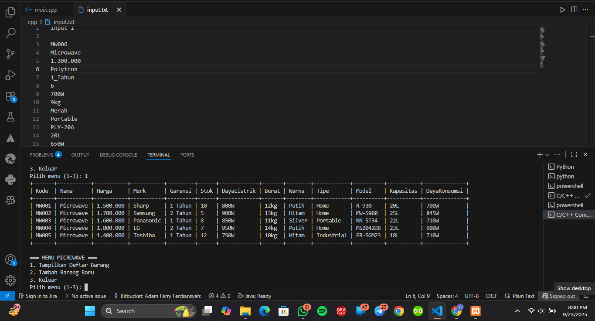
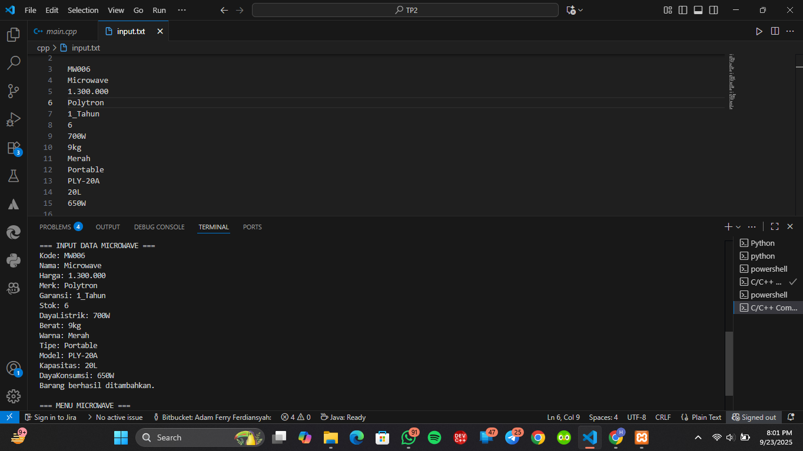
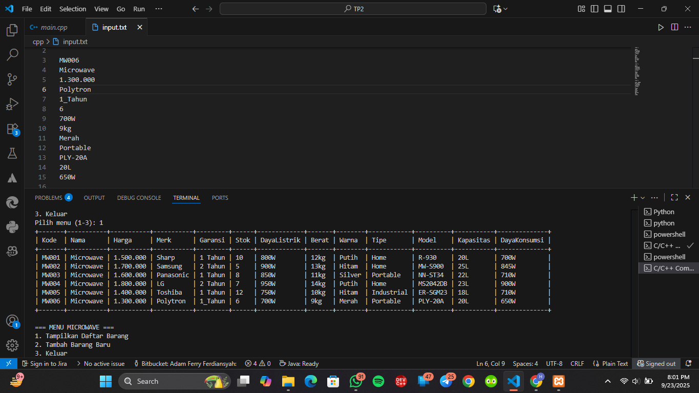

# TP2DPBO2425C1

Saya Hawa Dwiafina Azahra dengan NIM 2400336 mengerjakan Tugas Praktikum 2 dalam mata kuliah Desain dan Pemrograman Berorientasi Objek untuk keberkahanNya maka saya tidak melakukan kecurangan seperti yang telah dispesifikasikan. Aamiin.

1. atribut & method
   - class Barang
     - atribut
       - kode -> kode unik barang
       - nama -> nama produk / nama barang
       - harga -> harga produk
       - merk -> merk produk elektroniknya
       - garansi -> waktu garansi produk
       - stok -> jumlah barang yang tersedia
       - (PHP khusus) gambar → nama file gambar produk (misalnya "sharp.jpg")
         
      - method
         - constructor -> inisialisai atribut
         - getter & setter -> akses mengambil/membaca dan mengubah/mengisi tiap atribut
         - info() (c++ & java) -> untuk menggabungkan semua atribut
         
    - class KitchenAppliances (inheritence dari class Barang)
      - atribut
         - dayaListrik -> kebutuhan daya listrik produk
         - berat -> berat produk
         - warna -> warna produk
         - tipe -> tipe penggunaan (home, portable, industrial)
      - method
         - Constructor → selain atribut dari Barang, tambah atribut baru
         - Getter & Setter → akses mengambil/membaca dan mengubah/mengisi tiap atribut
         - info() (C++/Java) → menggabungkan dan tampilkan semua data barang + kitchen appliances
    - class Microwave (inheritance dari class KitchenAppliances)
      - atribut
         - model → kode model produk
         - kapasitas → volume kapasitas 
         - dayaKonsumsi → daya aktual yang dikonsumsi (daya yang terpakai ketika produk digunakan)
      - method
         - Constructor → panggil constructor parent, lalu tambah atribut baru
         - Getter & Setter → akses mengambil/membaca dan mengubah/mengisi tiap atribut
         - asList() (Python) / asArray() (Java/PHP) → ubah objek ke array/string list (buat tabel)
         - tampilkan() (C++) → cetak isi data ke tabel
         - cetakHeader() (C++) → cetak header tabel
         - tambahBarang() (C++) → input manual data baru
         - info() (C++/Java) → return semua data dalam string
  
2. Diagram design
   

3. alur program
   - alur umum
     - Program mulai → tampilkan menu
     - 5 data awal Microwave sudah hardcode
     - User pilih menu:
        - Tambah Barang → input data baru, dicek apakah kode duplikat
        - Tampilkan Barang → tampilkan semua barang dalam bentuk tabel
        - Keluar → keluar dari program
     - Tabel ditampilkan dengan lebar kolom menyesuaikan isi data
       
   - alur C++
     - Data microwave disimpan dalam array statis (Microwave daftar[100]).
     - tambahBarang() dipanggil untuk input data baru.
     - Fungsi cetakHeader() + tampilkan() dipakai buat bikin tabel.
     - Pengecekan kode duplikat dilakukan manual dengan loop.
       
   - alur python
     - Data microwave disimpan dalam list.
     - Fungsi print_table() dipakai untuk menampilkan tabel rapi.
     - Pengecekan duplikat dilakukan sebelum append dengan loop.
     - as_list() dipakai untuk ambil semua atribut dalam bentuk array string.

   - alur PHP
     - Data microwave disimpan dalam array of objects.
     - printTable() menampilkan data dalam bentuk tabel HTML.
     - Ada kolom gambar produk ().
     - Tidak ada input user, semua data hardcode.
       
   - alur Java
     - Data microwave disimpan dalam ArrayList.
     - Pengecekan duplikat dilakukan lewat fungsi cariKode().
     - asArray() dipanggil supaya data bisa ditampilkan dalam tabel dinamis.
     - Input dilakukan dengan Scanner.
    
4. dokumentasi
   - C++
     
     
     
     
